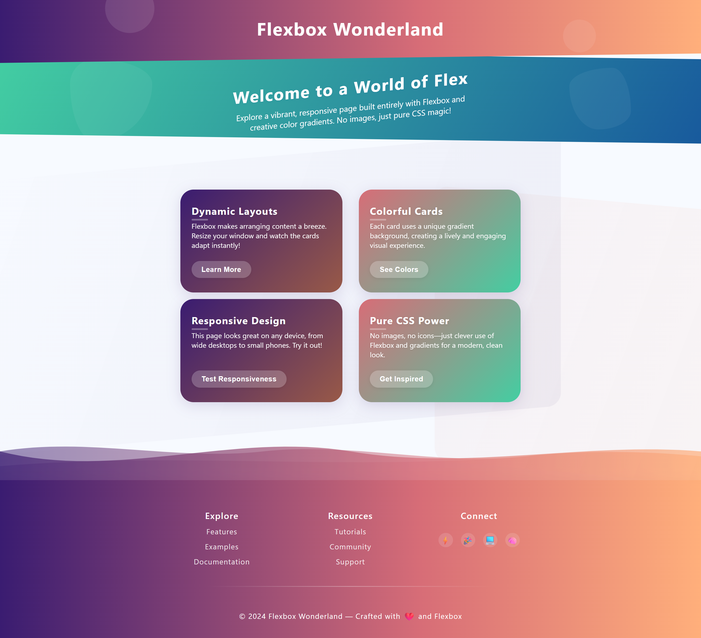
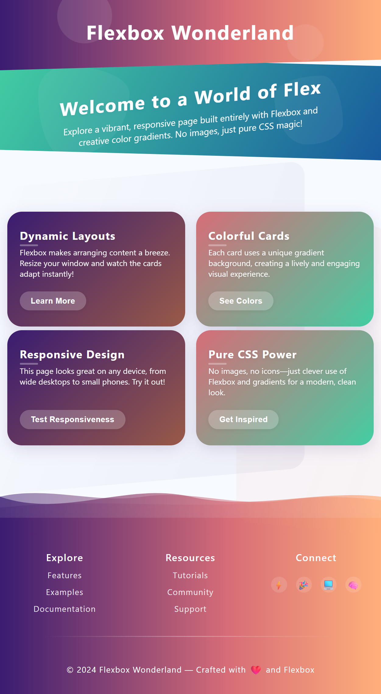
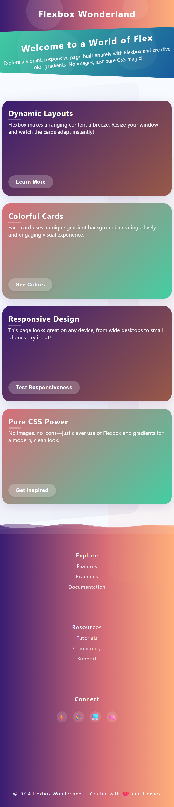

# Flexbox-Debugging Übung

## Aufgabe: Flexbox Wonderland reparieren

Die Website "Flexbox Wonderland" wurde erstellt, um die Leistungsfähigkeit von CSS Flexbox zu demonstrieren. Leider sind alle Flexbox-Eigenschaften aus dem CSS-Code entfernt worden, und die Seite ist jetzt völlig kaputt!

### Deine Mission

Finde und füge die fehlenden Flexbox-Eigenschaften wieder hinzu, um die Website zu reparieren und sie so aussehen zu lassen wie auf den Referenzbildern. Du musst herausfinden, wo genau die Flexbox-Eigenschaften hingehören und welche Werte sie haben sollten.

### Die Seite sollte so aussehen:

#### Desktop-Ansicht


#### Tablet-Ansicht


#### Mobile-Ansicht


## Anleitung

1. **Analysiere den HTML-Code und die CSS-Stile**:
   - Untersuche die Struktur der Webseite
   - Identifiziere Container, die flexibel angeordnet werden sollten

2. **Finde die problematischen Bereiche**:
   Die folgenden Elemente benötigen höchstwahrscheinlich Flexbox-Eigenschaften:
   - `body`: Sollte ein flexibler Container sein, der die Seite vertikal strukturiert
   - `header`: Zentrierung des Inhalts
   - `.hero` und `.hero-content`: Vertikale Anordnung und Zentrierung 
   - `.card-section`: Struktur für die Kartenabschnitte
   - `.card-grid` und `.card-row`: Anordnung der Karten
   - `.card`: Die interne Struktur jeder Karte
   - `.footer-content`, `.footer-sections`, `.footer-section`: Anordnung des Footers
   - `.footer-links` und `.footer-icons`: Anordnung der Links und Icons

3. **Füge die richtigen Flexbox-Eigenschaften hinzu**:
   - `display: flex`: Um ein Flexbox-Layout zu erstellen
   - `flex-direction`: Um die Richtung der Flex-Items zu bestimmen (row, column)
   - `justify-content`: Zur horizontalen Ausrichtung
   - `align-items`: Zur vertikalen Ausrichtung
   - `flex-wrap`: Um das Umbrechen von Items zu kontrollieren
   - `gap`: Für Abstände zwischen den Flex-Items (wo nötig)
   - `flex` Eigenschaften: Bei Bedarf für die einzelnen Items

4. **Teste die Responsivität**:
   - Überprüfe, ob die Seite bei verschiedenen Bildschirmgrößen korrekt angezeigt wird
   - Achte besonders auf die Tablet- und Mobile-Ansicht

## Hilfestellungen

Achte auf folgende häufige Probleme:

1. **Vertikale Staplung**: 
   Elemente sind horizontal angeordnet, sollten aber vertikal gestapelt sein (oder umgekehrt).
   ```css
   display: flex;
   flex-direction: column;
   ```

2. **Zentrierungsprobleme**:
   Elemente sind nicht zentriert oder nicht korrekt ausgerichtet.
   ```css
   display: flex;
   justify-content: center;
   align-items: center;
   ```

3. **Karten brechen nicht um**:
   Karten sollten bei kleineren Bildschirmen umbrechen.
   ```css
   display: flex;
   flex-wrap: wrap;
   ```

4. **Unangemessene Größenanpassung**:
   Elemente nehmen nicht den richtigen Anteil des verfügbaren Platzes ein.
   ```css
   flex: 1 1 260px;
   ```

5. **Fehlende Abstände**:
   Elemente haben keine konsistenten Abstände zueinander.
   ```css
   gap: 2.5rem;
   ```

## Bonus-Herausforderungen

Wenn du die Grundaufgabe gemeistert hast, versuche diese zusätzlichen Herausforderungen:

1. Verbessere die Animationen und Übergänge
2. Füge zusätzliche responsive Designelemente hinzu
3. Optimiere die Benutzererfahrung für Touchgeräte

Viel Erfolg bei der Fehlersuche und dem Debugging der Flexbox-Wonderland-Seite!
